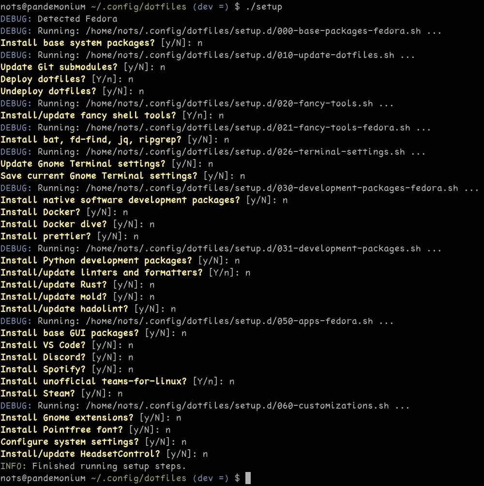
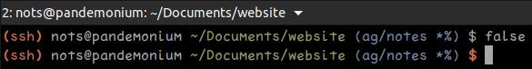
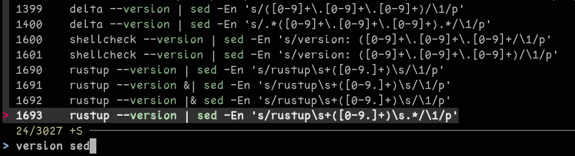
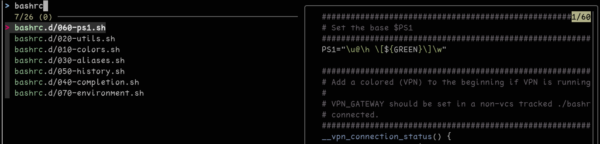
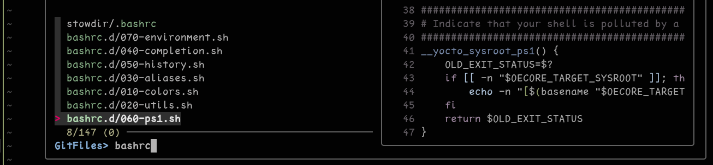
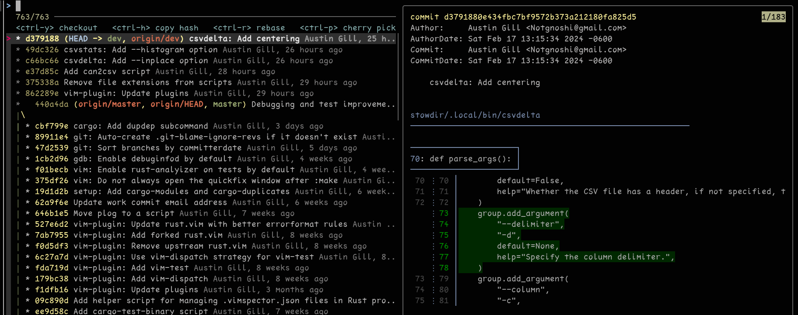

# dotfiles

My personal dotfiles and shell scripts

Customizes a vanilla Fedora or Ubuntu system to my preferences.

* [Prerequisites](#prerequisites)
* [Installation](#installation)
* [Setting up and maintaining a new system](#setting-up-and-maintaining-a-new-system)
  * [How it works](#how-it-works)
* [Shell scripts](#shell-scripts)
* [Shell customizations](#shell-customizations)
  * [bashrc](#bashrc)
    * [Keeping myself organized](#keeping-myself-organized)
    * [PS1 - bashrc.d/060-ps1.sh](#ps1---bashrcd060-ps1sh)
    * [History - bashrc.d/050-history.sh](#history---bashrcd050-historysh)
    * [Environment variables - bashrc.d/070-environment.sh](#environment-variables---bashrcd070-environmentsh)
  * [i <3 fzf](#i-3-fzf)
    * [A better reverse history search](#a-better-reverse-history-search)
    * [Finding files](#finding-files)
    * [Navigating in Vim](#navigating-in-vim)
    * [Browsing Git commits](#browsing-git-commits)
  * [tmux](#tmux)
* [Vim customizations](#vim-customizations)
  * [ALE](#ale)
  * [The rest](#the-rest)

---

# Prerequisites

* SSH keys should already be created and configured in GitHub user settings

  ```sh
  ssh-keygen -b 4096
  ```

* Prerequisite packages

  ```sh
  sudo dnf install vim-enhanced stow git curl
  ```

  ```sh
  sudo apt install vim-gtk stow git curl
  ```

# Installation

```bash
git clone --recurse-submodules git@github.com:Notgnoshi/dotfiles.git ~/.config/dotfiles
cd ~/.config/dotfiles
./setup
```

# Setting up and maintaining a new system

## How it works

Dotfiles are managed with [GNU Stow](https://www.gnu.org/software/stow/). Anything in the
[./stowdir/](./stowdir) is symlinked into my home directory. Stow can somehow detect script renames,
and delete the stale symlinks.

I _highly_ recommend Stow, _especially_ over doing it yourself.

Installed applications and system preferences are listed in various scriptlets in
[./setup.d/](./setup.d).

All of this is managed through the [setup](./setup) script, which handles Ubuntu/Fedora differences
using the `-fedora.sh` or `-ubuntu.sh` suffix on the `./setup.d/*.sh` scriptlets when there's
differences to account for.



# Shell scripts

I have lots of shell scripts in [~/.local/bin/](stowdir/.local/bin). Some I use _very_ often, some
are just one-offs.

Here's some of the highlights:

* `git-gl` - A better `git log` with an unforunate name that's now embedded in my muscle memory
* `clip` - Pipe to/from your Wayland/X11 clipboard.
* `docker-cwd` - Get an interactive shell in the current directory for the given Docker image. Has
  Bash completion for available Docker images
* `filter-wkt` and `wkt2csv` - Helpers for working with WKT geometry data
* `qgis-project` - Generate a QGIS project from a (nested) directory of CSV layer files
* `date2unix` and `unix2date` - Helpers to convert UTC timestamps between Unix timestamps and
  ISO-8061 timestamps. Useful for correlating between logs files in different formats
* `randpass` - Generate random passphrases that use alliteration
* `csvdelta` - calculate interrow deltas for a column in a CSV file
* `csvstats` - calculate summary statistics for a column in a CSV file
* `emoticon` - copy different emoticons to the clipboard
* `xldd` - A version of `ldd` that tries to be cross-compilation and Yocto SDK aware

# Shell customizations

## bashrc

### Keeping myself organized

As my bashrc and setup scripts have grown, I've found the need to break them apart. My `~/.bashrc`
nowadays is essentially

```sh
DOTFILES_DIR=# Resolve the symlink for this file

##################################################################################################
# Source each of components in alphabetical order.
##################################################################################################
for rcfile in "${DOTFILES_DIR}/bashrc.d/"*.sh; do
    [ -f "$rcfile" ] && source "$rcfile"
done
```

with some extra bookkeeping.

### PS1 - [bashrc.d/060-ps1.sh](bashrc.d/060-ps1.sh)



My PS1 is fairly dynamic and gives several useful at-a-glance status indicators:

* Color the trailing `$` red if the previous command failed
* Utilize the excellent
  [`__git_ps1`](https://github.com/git/git/blob/master/contrib/completion/git-prompt.sh) if it
  exists
* List the number of background jobs, if there are any
* Indicate whether I'm connected to the current device over SSH or a serial connection (requires
  this PS1 to be configured on the remote device)
* Indicate whether this shell's environment has been polluted by a
  [Yocto SDK](https://docs.yoctoproject.org/sdk-manual/index.html), and which SDK, if it has been
* Indicate if my work VPN is running, and if it is, whether or not it has a route to the gateway
  * Requires `VPN_GATEWAY` be set, which I do with `bashrc.d/100-work.sh`, which is `.gitignore`d

**I highly recommend using `__git_ps1`. I frequently see coworkers getting confused because they
weren't aware of the state their worktree was in before or after some Git incantation.**

### History - [bashrc.d/050-history.sh](bashrc.d/050-history.sh)

* Keep an infinite history
* Keep track of the date and time each command was run on
* Share the same history between every shell

**IMPORTANT:** Don't mount your home directory in a Docker container - that's _asking_ to get your
history wiped out.

### Environment variables - [bashrc.d/070-environment.sh](bashrc.d/070-environment.sh)

I refuse to run `sudo make install`.

So I use environment variables to make `~/.local/` act just like `/usr/local/`.

## i <3 fzf

[fzf](https://github.com/junegunn/fzf) has had a profound impact on my perceived usability of the
terminal.

### A better reverse history search

Pressing `ctrl-r` will start a reverse history search. The one provided by GNU Readline is perfectly
useable, but FZF's is just _better_. It shows me the closest matches to my query, and I don't have
to spell something perfectly.



This combines nicely with a permanent Bash history.

### Finding files

Outside of Vim, I use `ctrl-t` to open a fuzzy file-finder.



### Navigating in Vim

Inside of Vim, I use `:GFiles` and sometimes just `:Files` to do exactly the same thing. I use this
often enough that I have keybinds for it.



I also use `:Buffers` to switch between open buffers, and `:Rg [pattern]` to use `ripgrep` to
recursively `grep` a codebase. Using `tab` to select results loads them into the quickfix list.

`:Rg` is a much more powerful `:vimgrep`.

### Browsing Git commits

Within Vim, there's also `:BCommits` and `:Commits` to view the Git commits for the current buffer,
or the whole project respectively.

I tend not to use this, because it's been difficult to customize, so I built
[git-gl](stowdir/.local/bin/git-gl) to do the same thing. It's effectively a console version of
[gitk](https://lostechies.com/joshuaflanagan/2010/09/03/use-gitk-to-understand-git/) that's
optimized for my workflow.



It accept any argument that `git log` accepts, and also has
[Bash completion](stowdir/.bash_completion.d/git-gl.bash-completion) to tab-complete, because that's
just plain nice.

* Press `enter` to open `git show` for the selected commit, using
  [`delta`](https://github.com/dandavison/delta) as the pager, which provides word diffs, and
  side-by-side diffs if the terminal is wide enough.
* Press `ctrl-y` to `git checkout` the selected commit
* Press `ctrl-h` to copy the selected commit's hash to my clipboard (useful for
  `git commit --fixup=<hash>` commits)
* Press `ctrl-p` to `git cherry-pick` the selected commit onto your current branch (you probably
  only want to do this if you run `git gl` on a branch other than your current one).
* Press `ctrl-r` to perform an interactive rebase targetting the selected commit

Grooming a Git branch's history is like combing hair. **Never** start at the root and yank all the
way to the tip. Instead, start at the root and make tiny short strokes, working your way to the tip.

(I don't have long hair, so maybe I have the direction backwards; it seems like working your way
from the tip to the root would be less painful?)

I don't run `git log` or `git rebase` by hand anymore.

## tmux

I used to use [Tilix](https://github.com/gnunn1/tilix) as my terminal emulator, but it's
unmaintained, and sometimes crashes. The primary reason I used to use it was to get side-by-side
terminal panes.

I now use tmux for this, and have found I quite like it.

I use [vim-tmux-navigator](https://github.com/christoomey/vim-tmux-navigator) to use the same
keybinds `ctrl-{h,j,k,l}` to seamlessly navigate between Vim splits and tmux panes.

# Vim customizations

## ALE

I use [ALE](https://github.com/dense-analysis/ale) to provide completion, code formatting, and
linting in Vim. It supports any language I care to use, and provides enough configuration hooks for
me to use whatever formatter / linter / LSP a project requires.

I mostly use

* rust-analyzer
* clangd
* clang-format
* clang-tidy
* black
* isort
* pydocstyle
* gitlint

ALE provides the IDE experience I want:

* Jump to definition
* Find references
* Rename
* Completion
* Static-analysis lints
* Compilation warnings and errors

I don't want a "big green 'go' button", because my experience has shown me that

* You get IDE lock-in to sub-par IDEs when a work project requires an IDE just to build a project
* Understanding how the build works is important!
* Not understanding how the build works results in developers that don't know how to troubleshoot
  CI/CD pipelines
* Building a project at your terminal and the CI/CD pipeline should be the same experience - or else
  developers won't trust the pipeline

## The rest

I won't list each plugin, but here's the important ones:

* https://github.com/dense-analysis/ale

  Discussed above
* https://github.com/ericcurtin/CurtineIncSw.vim

  Switch between C++ headers and source files. Uses heuristics and sometimes gets it wrong.
* https://github.com/tpope/vim-commentary

  Provides nice ways to comment and uncomment code blocks
* https://github.com/junegunn/fzf and https://github.com/junegunn/fzf.vim

  Discussed above
* https://github.com/puremourning/vimspector

  Use VS Code debug adapters from Vim. Better than `:Termdebug`, but finicky configuration
* https://github.com/Notgnoshi/rust.vim

  A fork of the upstream https://github.com/rust-lang/rust.vim that is seemingly unmaintained
* https://github.com/SirVer/ultisnips

  Provides snippets. I rarely use, except for default Bash and Python script templates.
* https://github.com/djoshea/vim-autoread

  Detect external changes
* https://github.com/tpope/vim-dispatch

  Adds `:Make` that runs `:make` in the background, loading `errorformat` results into the quickfix
  list once it's done. Nice integration with `vim-test`
* https://github.com/vim-test/vim-test

  Nice support for running tests from within Vim. Can run the test under the cursor, and load test
  results in the quickfix list.
* https://github.com/tpope/vim-fugitive

  Really nice Vim + Git integration. Would use it more if I weren't so set in my ways
* https://github.com/airblade/vim-gitgutter

  Show gutter signs for additions, removals, and modifications
* https://github.com/michaeljsmith/vim-indent-object

  Text objects for indentation. Quite nice for Python projects where you can't use iB/aB with
  braces.
* https://github.com/tpope/vim-surround

  Surround things with matched delimiters or HTML tags. I use all the time. Was what showed me that
  text objects are super powerful.
* https://github.com/christoomey/vim-tmux-navigator

  Seamlessly navigate between Vim splits and tmux panes
